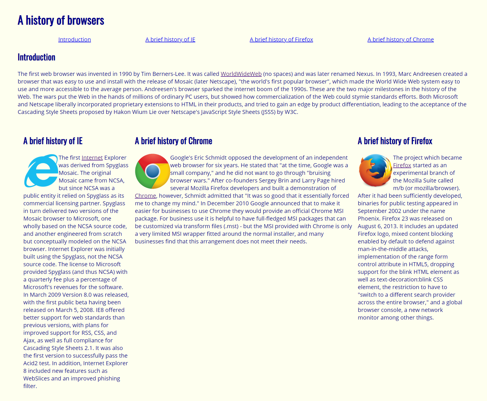

## The Basics of Web Development
I've browsed thousands of websites throughout my lifetime, yet I've rarely stopped to think about the code behind menu bars, dropdowns, and overall content of a page. I now frequently find myself thinking about the HTML elements that comprise webpages and the CSS that styles them; HTML and CSS unveiled another aspect of code in my everyday life. The raw amount of HTML and CSS that goes into some website are marvelling. I had a go at web development in my Browser History WOD:



You'll notice it's unlike any other mainstream website, and not in a good way. The site has a ghetto appeal to it. The navigation bar is a horizontal list with links that navigates you 2-3 scrolls down the page. There are uneven chunks of text and images that seem out of place. Recoloring and font changes barely conceal its dullness. I picture this is what everyone's first website looks like. In comparison, the websites we scroll past contain significantly more stylistic elements and must contain even more code. If only there was a way to simplify web development...

## Introducing... Semantic UI
UI frameworks are a set of tools that help you do just that! Semantic UI, for example, is an exceptional tool that assists in styling your webpage. After watching a 3 hour tutorial, Semantic UI felt daunting. Those 3 hours were crammed with new terminology and elements; I felt I hadn't retained much information. However, tackling ui classes bit by bit developed my understanding and appreciation of Semantic UI. It emphasizes simplicity in styling websites, especially through adjectives. If I wanted a top menu with an inverted color scheme and four equally divided items, I would simply write ````<div class="ui fixed top inverted four item menu">````. Ask and you shall receive in Semantic UI. 

Semantic Browser History img

## Invest Today
In return for the investment of time and frustration, tools from UI frameworks can heavily style your page without the excessive need for HTML and CSS. A few drops of Semantic UI transformed my previous Browser History page into one that's more coherent and appealing. There's boundlessly more options to explore with Semantic UI. For software engineers, UI frameworks may be a gateway into higher level web development. Also, I believe if people devoted time to creating these libraries and tool sets, you might as well utilize them! 

Teddy Fresh img
