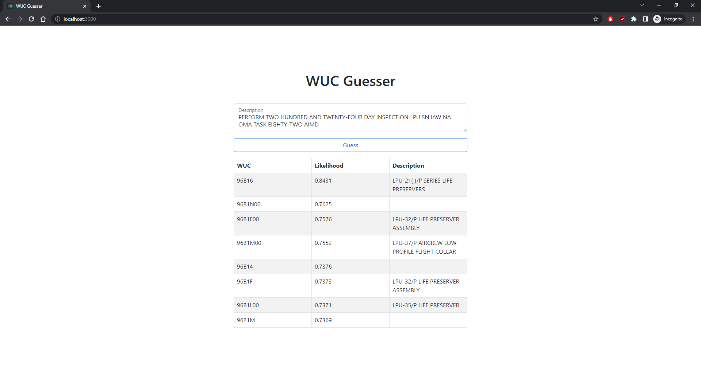

<iframe src="https://www.linkedin.com/embed/feed/update/urn:li:share:6975672531328409600" height="344" width="504" frameborder="0" allowfullscreen="" title="Embedded post"></iframe>

[Visit Project Poster](../img/nlp-maint/nlp-maint-poster.pdf)

## Marine Corps Maintenance Information System

At the time aircraft maintenance is performed, engineers log the maintenance data and the corresponding work unit code (WUC) that informs engineers about which systems are failing and when they might fail. The WUC is hierarchical in nature. For example, a right wing might be code `050`, the fuel tank in the right wing `05030`, and the broken fuel line `05030A105`. Engineers use WUC data to optimize the supply and distribution chain. 

The current maintenance information system includes a tree system of WUCs that engineers manually traverse to identify the correct WUC. 

## The Problem

The WUC tree system was 1\) large and complex and 2\) required manual selection. It did not facilitate fast or accurate data entry at the time of maintenance. After visiting the Marine Corps Base, we encountered further issues:

- Engineers did not accurately log WUCs during unscheduled inspections due to tighter time constraints
- The current maintenance system has a premium on experience + many engineers are only in-role for a few years

The problem was introduced to us during my Capstone course. My team of 4 worked in agile sprints facilitated by GitHub Project Boards and Issues. 

## An AI Chatbot

The proposed solution was to train a model on historical data to predict possible matching WUCs. Luckily, there were 10 million records of maintenance descriptions and matching WUCs; natural language processing was used to process and analyze the descriptions. With the pre-trained model, a "chatbot" app was built to take in user descriptions and output WUC predictions. The chatbot would assist in the fast and accurate data collection of WUCs. 

#### Meaningful Representations of Words

Machines cannot understand or process words, and so we need to meaningfully encode words into numbers. A naive approach is with [one-hot vectors](https://en.wikipedia.org/wiki/One-hot#Natural_language_processing), but a better approach to represent word relationships is with [word embeddings](https://en.wikipedia.org/wiki/Word_embedding). Words are encoded as real-valued vectors in such a way that words similar in meaning are closer in vector space! An in short, they are generated using neural networks. 

I chose Facebook's [fastText](https://fasttext.cc/) package for word embeddings. As the name implied, it was fast for training. But also, it learned character level information through character n-grams. This improved on rare words and misspelled words which we encountered many of in the historical data. 

#### A Weighted-average Sequential Classifier

Some challenges were the abundance of unique WUCs (60 thousand) and the data imbalance of WUCs. To address this, we trained a custom sequential classifier to leverage the hierarchical structure of the WUC tree. Predictions are a weighted average of scores from optimized decision tree classifiers: the general model, the model guessing the first WUC character, the model guessing the first two WUC characters, and so on. 

#### App Architecture

I led the architecture and development of the app. The app uses: 

- Flask to serve the pre-trained model with Gunicorn to host the Python Application Server
- React for the View with Nginx to host the Web Server
- Redis as a key-value store for WUC, description pairs
- Docker to build the multi-container app



## Results

My team developed a proof of concept demonstrating the feasibility of the pre-trained model and the chatbot to the Marine Corps; the app would improve aircraft maintenance data accuracy and maintenance time by accurately automating the WUC selection process. 

- Engineers do not have to traverse the complex WUC tree system, mitigating the barrier to entry
- Data accuracy improves the supply chain as a whole

Currently, the correct WUC is predicted in a list of 8 predictions 80% of the time (Recall = 0.80). 

## Containerized Development

Docker packages software into standardized units called containers that contain code, libraries, runtime, everything the software needs to run! Building the chatbot app manually was tedious considering the many Python libraries, tools, and frameworks. With containers, my teammates did not have to build the app on their machines manually; they could build and test the app quickly with three commands:

```
docker build -f Dockerfile.api -t nlp-api .
docker build -f Dockerfile.client -t nlp-client .
docker-compose up
```

Futhermore, containerized apps can be quickly deployed and scaled on cloud services such as Azure and AWS. 
