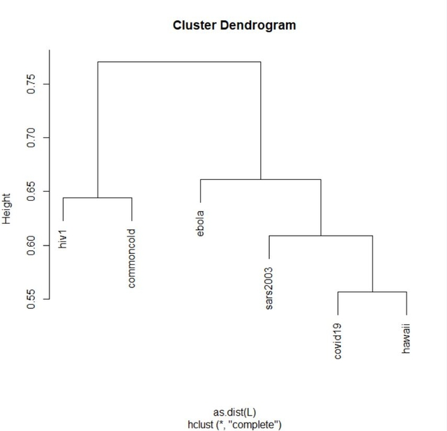

Over the summer, I worked with a research team comprised of 3 undergraduates, 2 graduates, and my Calculus professor. One of our research topics was of the Lempel-Ziv Jaccard distance (LZJD): the measurement of the similarity between two sets. We applied the LZJD and other variations of it to genome and protein sequences to see if it was efficient as an alignment-free sequence comparison method. Also, we extended the LZJD to multiple sets. Research involved using golang implementations of various LZJD calculators to calculate distances between genomes. We presented our findings at the 2020 SURE symposium.

For this research project, I mainly worked on implementing the various distance calculators in golang. I started by implementing a simplified version of the LZJD; the function generates a simplified LZ dictionary and the JD calculates the distance between two dictionaries. I utilized maps in golang to significantly decrease the runtime of the function when called on genome sequences. Next, I implemented Otu-Sayood distance calculators based on LZ complexity. I used R to generate phylogenetic trees from the distance matrices of some genomes. Unfortunately, the generated phylogenetic trees were not too accurate meaning the LZJD may not be best for comparing genome sequences. 

I experienced being in a college-level research team. It was a great opportunity to apply my classroom knowledge outside of class. Working alongside graduates and a professor broadened my professional scope. I learned valuable communication and teamwork skills. Also, it was interesting to see how different majors could be integrated into a research project (math, biology, and CS).  

Here is some code that illustrates how maps were utilized:

```golang
_, exists := wordMap[word] 
			if !exists { //if word is not in wordMap
				wordMap[word] = struct{}{} //add word to wordMap
				myDict = append(myDict, word) //add word to dictionary
				i += len(word) - 1 //set i to end of word
				break
			}
```
