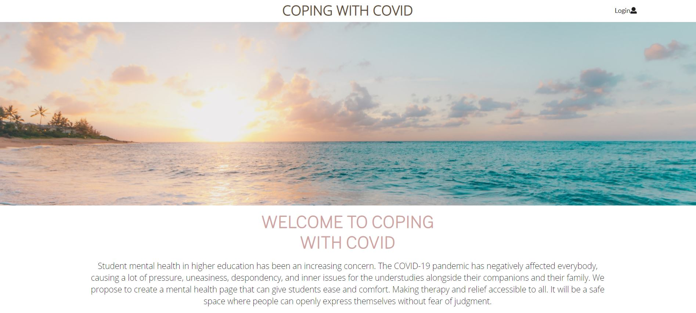
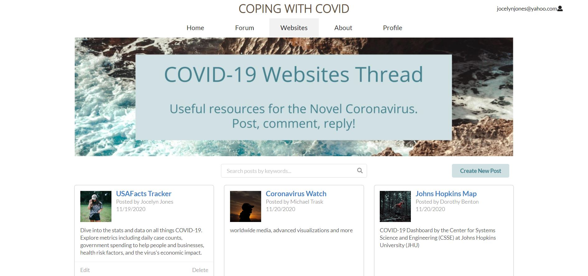
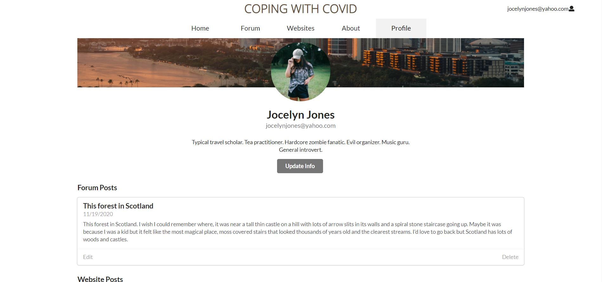

For our final project for ICS 314, my team and I developed a web application aimed to help students cope with the COVID-19 pandemic. The pandemic has burdened and stressed many people, especially college students. Coping With Covid is a daily discussion forum for students to express themselves openly. Students can answer the question of the day on the discussion forum with their stories or interact with others' stories. Also, they can share helpful resources on the websites forum. Coping With Covid was built using Meteor, React, and Semantic UI.

I worked mainly on the project's functionality such as implementing adding/editing posts, comments, and profiles and their respective collections in MongoDB. The two main pages I worked on were the websites forum page and the profiles page. I made sure all aspects were fully functional, from links to profiles or websites to search bars. As for the UI, I designed those pages based off mockups from one of my team members.

  
  

Coping With Covid was my introduction to developing a web application. Through it, I've gained significant insight and experience to the internals of a web app. For example, designing and manipulating data collections in mongoDB. It also strengthened my React and Javascript skills as I was able to implement functionality and not simply the ui. Throughout the project, I found myself struggling with coding the display of pages. HTML/CSS is an area I need to improve on, however, semantic UI definitely simplified things. Finally, I experienced what it was like to work on code as a team; prior coding assignments were all individual. Issue driven project management helped immensely in organizing the project such as deadlines, task assignment, and communication. I will definitely be using IDPM and GitHub for my future projects. Overall, I'm proud of what my team and I accomplished in a month.

Visit our web application [here](https://copingwithpandemic.xyz/#/) or our project homepage on [GitHub pages](https://coping-with-covid.github.io/)!
