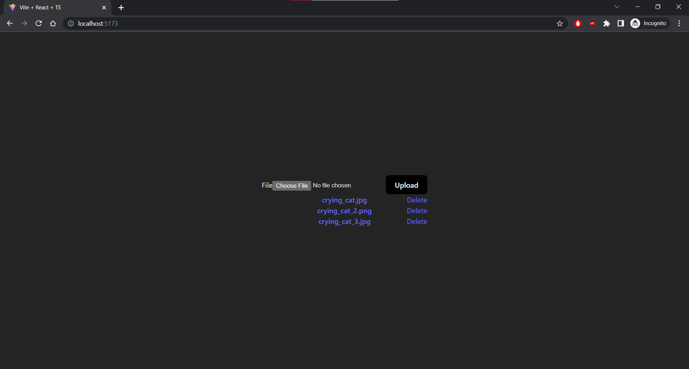

[Visit GitHub Repo](https://github.com/guanhongl/s3-upload-google-auth)

## A Cloud Storage App

AWS S3 Upload is a cloud storage app that provides users a secure method to store and access their files on the cloud. I built this app to "clone" Google Drive and to practice cloud computing. App features include uploading, downloading, and deleting files on Amazon S3 via a simple user interface. Moreover, the app uses Google OAuth authentication to protect user data; users must login with a Google account to access their files. The app is built on the MERN Stack, or MongoDB, Express, React, and Node. 

## OAuth at a Glance

OAuth, or Open Authorization, is a secure approach to authenticate users inside an app via third-party services such as Google and Facebook. In the app, the user is redirected to a Google authorization server upon login and prompted with a consent screen asking to grant access to their Google profile info to the app for login. If allowed, then the user is logged into the app via their Google credentials; these credentials can be expired or revoked by the user. The key is: no passwords are stored or shared! 

<div class="container text-center">
  <div class="row">
    <div class="col">
      
    </div>
    <div class="col">
      
    </div>
  </div>
</div>

## OAuth the BIG Picture

I use [Passport.js](https://www.passportjs.org/) with Express to integrate Google OAuth. Let's dive into the OAuth flow. *I use Express to build the app's RESTful API endpoints. These endpoints are essentially a series of middleware function calls, or functions that can make changes to the request and response objects and call the next middleware function in the req-res cycle. Passport uses such middleware.* 

1. The login button routes users to `/auth/google`. Passport then routes users to a Google auth server and requests their profile info, defined by `scope`, on the consent screen.

    ```js
    app.get(
        "/auth/google", 
        passport.authenticate("google", { scope: ["profile"] }),
    )
    ```

2. If users grant the app permission, then they are redirected to the `callbackURL` with the `code` query parameter. *Before using Google OAuth, you must register the app with Google to obtain the `clientID` and `clientSecret` which need to be provided to the Passport strategy*.

    ```js
    passport.use(new GoogleStrategy({
            clientID: process.env.GOOGLE_CLIENT_ID as string,
            clientSecret: process.env.GOOGLE_CLIENT_SECRET as string,
            callbackURL: "http://localhost:5000/auth/google/callback",
        },
        function(accessToken, refreshToken, profile, callback) {
            return callback(null, profile)
        }
    ))
    ```

3. Passport routes to a Google auth server once more to exchange the `code` for users' profile info. Once the app receives users' `profile`, the `callback` function fires to add `profile` to the request object and call the next middleware function.

    ```js
    app.get(
        "/auth/google/callback", 
        passport.authenticate("google", { failureRedirect: "http://localhost:5173/error" }),
        function(req, res) {
            res.redirect("http://localhost:5173")
        },
    )
    ```

4. Passport serializes `profile` then adds the serialized `profile` to the request object and calls the next middleware function. Then the app creates the encrypted profile info cookie with a `maxAge` of 1 day. The cookie is added to the response object, via the `Set-Cookie` HTTP response header. Finally, the app redirects authenticated users to the files page. The browser receives the cookie and stores it for future authentication.

    ```js
    passport.serializeUser(function(profile, callback) {
        callback(null, profile)
    })

    app.use(cookieSession({
        name: "session",
        secret: "secret",
        maxAge: 24 * 60 * 60 * 1000, // 24 hours
    }))
    ```

5. When authenticated users send subsequent requests to the app, the browser sends the stored profile cookie via the `Cookie` HTTP request header. The app then decrypts and deserializes the cookie to retrieve the profile info for authentication!

    ```js
    passport.deserializeUser(function(profile, callback) {
        callback(null, profile as any)
    })
    ```

## Amazon's Object Storage Service

Amazon S3 (Simple Storage Service) is a cloud-based object storage service that allows users to store and retrieve data from anywhere on the web. It provides scalable, secure, and highly available storage infrastructure for a variety of use cases. I integrate S3 for uploading, downloading, and deleting files on the app without worrying about the underlying infrastructure. 

Configuring and creating an S3 bucket is surprisingly simple. I use [AWS SDK](https://aws.amazon.com/sdk-for-javascript/) to call AWS services using JavaScript APIs on my Node app. The app must obtain my AWS account credentials before it can access services through the API. In development, AWS SDK automatically loads these credentials from my shared credentials file on `C:\Users\USER_NAME\.aws\credentials`! In production, you would likely load your credentials from environment variables. Then I simply created an S3 bucket in my AWS Management Console. 

To access services through the JavaScript API, I first created an S3 service object through which I access a set of features provided by the underlying client class. Then, I set up the RESTful API endpoints for uploading, downloading, and deleting with Express. Here is an example of the upload endpoint. I specify the `Bucket`, `Key` the object key, and the `Body` the object data or file buffer in our case in the POST endpoint. 

```js
// server
app.post("/files",
  ...
  
  await s3.upload({
      Bucket: process.env.BUCKET_NAME as string,
      Key: file?.originalname as string,
      Body: file?.buffer,
  })
  .promise()
  
  ...
)
```

```js
// client
const res = await fetch("http://localhost:5000/files", {
    method: "POST",
    body: formData,
    credentials: "include",
    headers: {
        "Content-Type": "multipart/form-data",
    },
})
```
