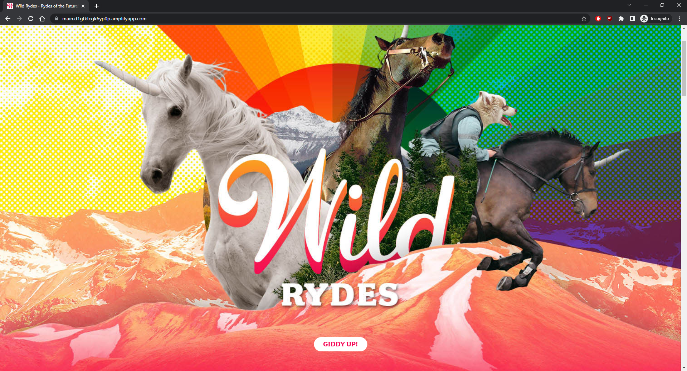
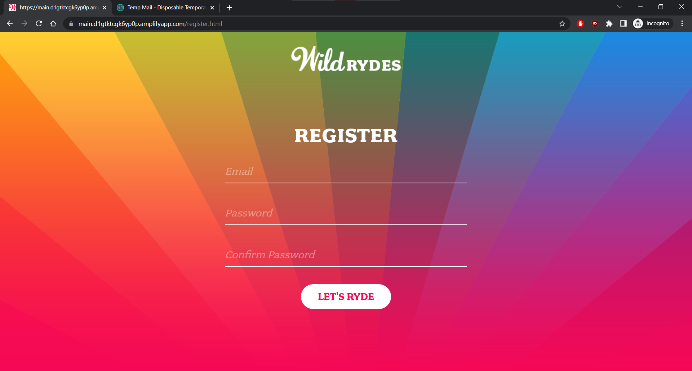

[Visit GitHub Repo](https://github.com/guanhongl/wildrydes-site)

## A Serverless Web App

Wild Rydes is a simple serverless web app that enables users to request unicorn rides from the Wild Rydes fleet. I built this app to practice designing and implementing cloud computing solutions. The idea came from Amazon's Getting Started Resource Center. The app presents users with an HTML-based user interface with Amplify for indicating the location where they would like to be picked up. The app interacts with a RESTful web service on the backend with API Gateway, Lambda, and DynamoDB to submit the request and dispatch a nearby unicorn. Users must register with the service and log in before requesting rides; Cognito is used for authentication. 

## App Architecture


#### Static Web Hosting

The app's static web content including HTML, CSS, JavaScript, and images is hosted by Amplify. Amplify exposes the public website URL and loads the static web content in the user's browser. Also, I connected my source code from my Git repo to Amplify to enable continuous deployment! 

#### User Management

I used Cognito for user management and authentication to secure the app's backend API. I created a user pool to manage the app's user accounts. Users must provide an email address and password to register. On submission, Cognito will send a confirmation email with a verification code to the email address. *I chose to send emails with Cognito, but for production I recommend using Amazon Simple Email Service (SES) due to rate limits.* After confirming their account, users are able to sign in. Then, the browser receives a set of JSON Web Tokens (JWT) which are used to authenticate against the RESTful API. 

<div class="container text-center">
  <div class="row">
    <div class="col">
      
    </div>
    <div class="col">
      
    </div>
  </div>
</div>

#### Serverless Backend

A serverless architecture is a way to build and run applications and services without having to manage infrastructure. Server management is abstracted by AWS so that developers can focus on the core product. I used Lambda and DynamoDB, a key-value store, to build the backend process for handling requests for a unicorn. When a user requests a unicorn, a Lambda function that selects a unicorn from the fleet is invoked. Also, the function records the request in a DynamoDB table then responds to the app with details about the unicorn. *Lambda runs code in response to an event trigger; triggers are often another AWS service such as API Gateway.* 

```js
// Lambda code snippet:
exports.handler = (event, context, callback) => {
    // We pick a unicorn at random.

    ...

    // Record the ride in the DynamoDB table.
    ddb.put({
        TableName: 'Rides',
        Item: {
            RideId: rideId,
            User: username,
            Unicorn: unicorn,
            UnicornName: unicorn.Name,
            RequestTime: new Date().toISOString(),
        },
    }).promise()
      .then(() => {
          // The response data.
          callback(null, {
              statusCode: 201,
              body: JSON.stringify({
                  RideId: rideId,
                  Unicorn: unicorn,
                  UnicornName: unicorn.Name,
                  Eta: '30 seconds',
                  Rider: username,
              }),
              headers: {
                  'Access-Control-Allow-Origin': '*',
              },
          });
      })

    ...
};
```

#### RESTful API

Finally, I used API Gateway to expose my Lambda function as a RESTful API secured using the Cognito user pool. The browser sends and receives data over API Gateway. Authenticated users request a unicorn ride by selecting their pickup location by clicking a point on the map, added by ArcGIS, then by clicking the "Request Unicorn" button. 

```js
// The client-side JavaScript that makes the AJAX request to the API:
function requestUnicorn(pickupLocation) {
    $.ajax({
        method: 'POST',
        url: _config.api.invokeUrl + '/ride',
        headers: {
            Authorization: authToken // The auth token sent by Cognito.
        },
        data: JSON.stringify({
            PickupLocation: {
                Latitude: pickupLocation.latitude,
                Longitude: pickupLocation.longitude
            }
        }),
        contentType: 'application/json',

        ...
    });
}
```

<div class="container text-center">
  <div class="row">
    <div class="col">
      
    </div>
    <div class="col">
      
    </div>
  </div>
</div>
